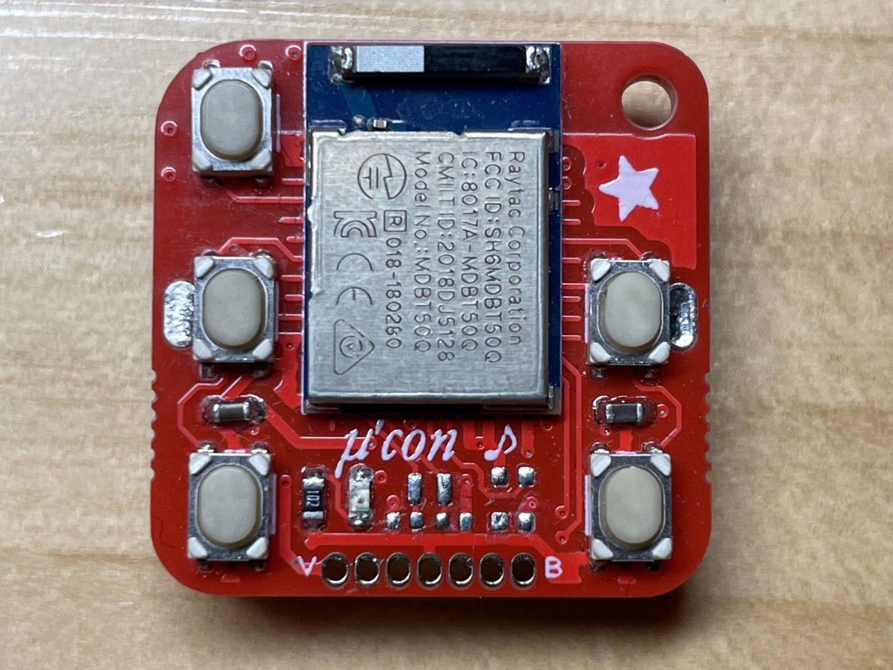
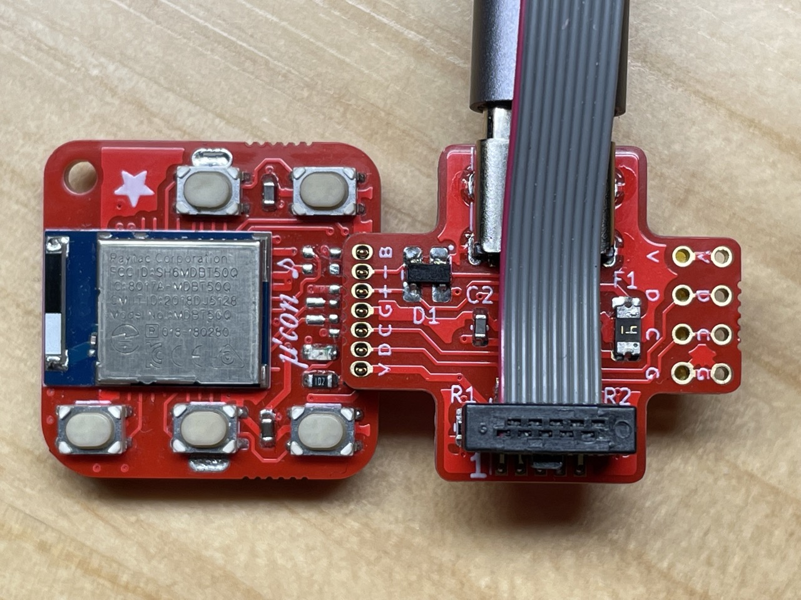
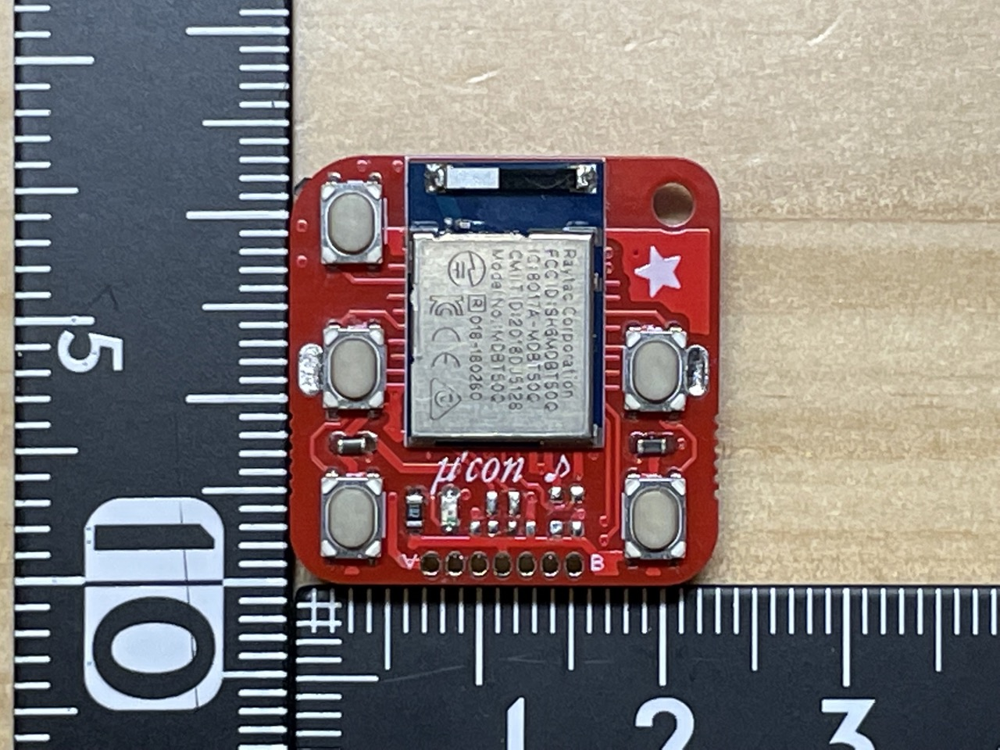
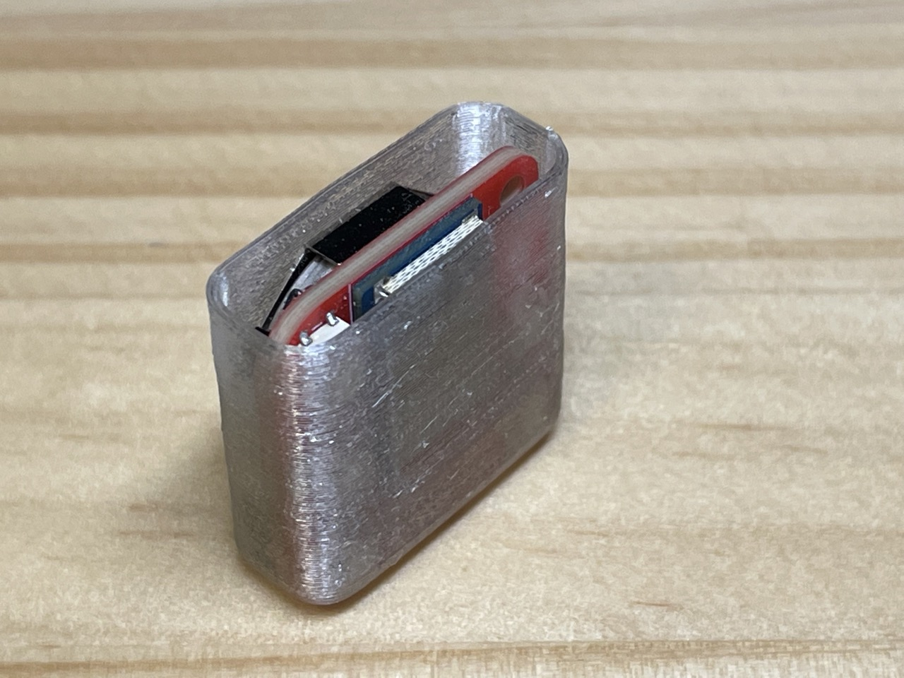
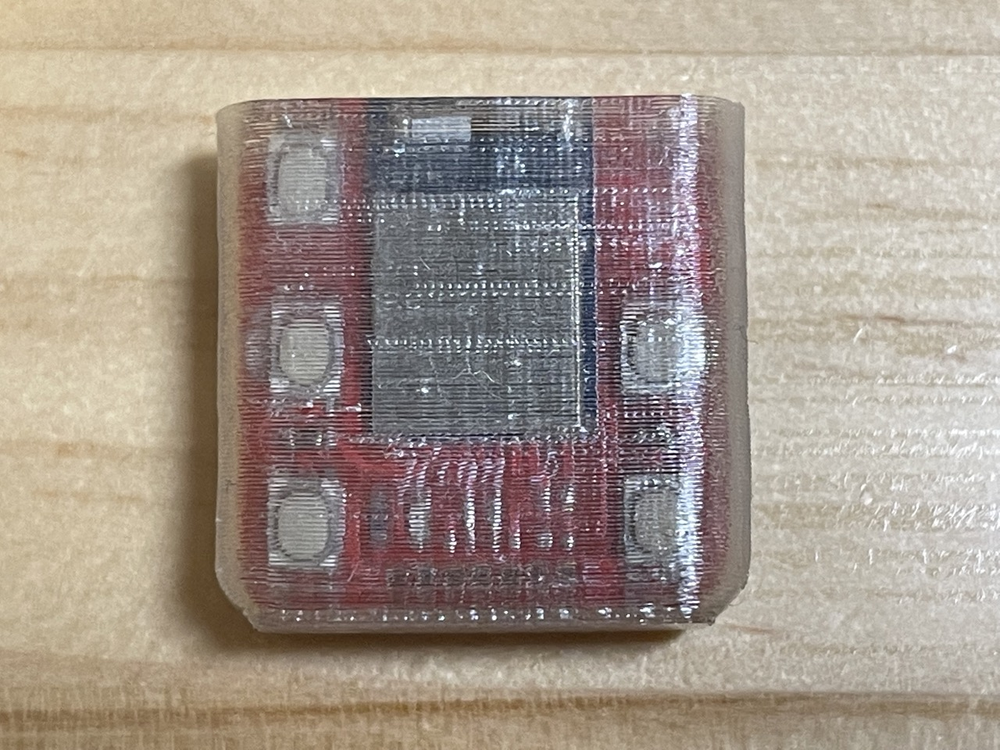
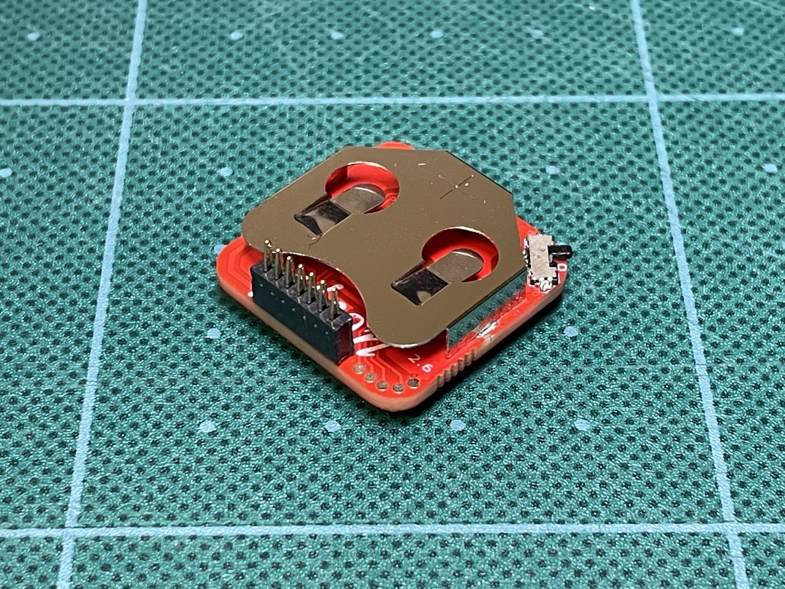
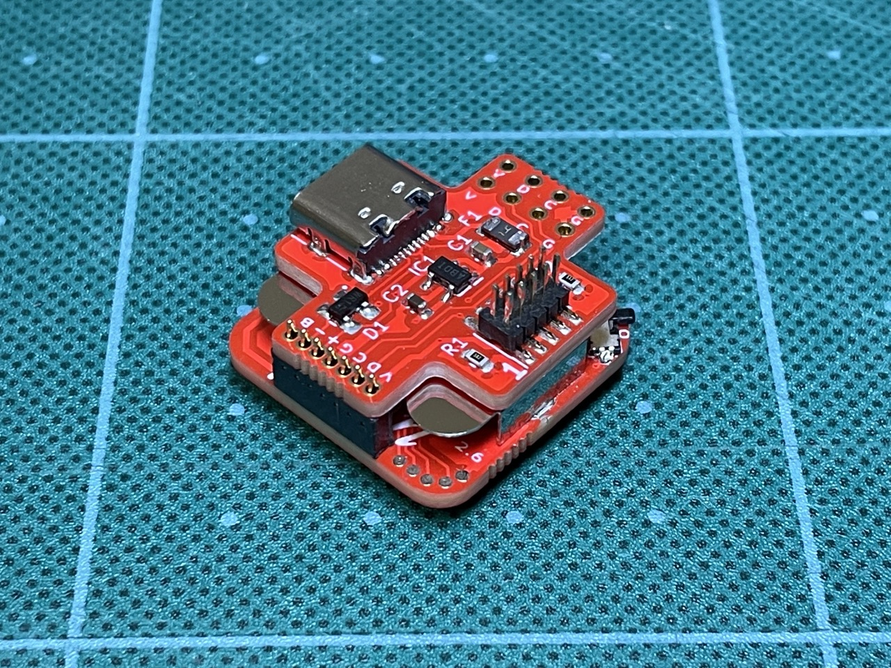
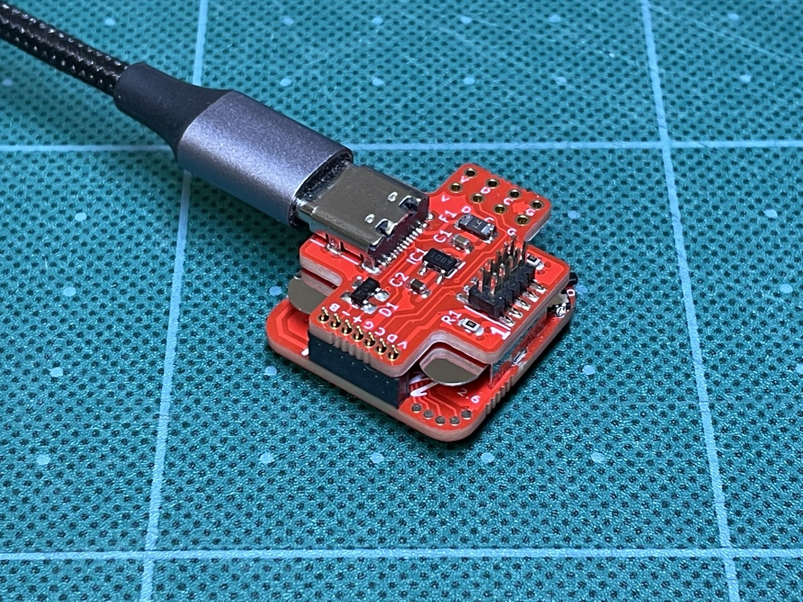

# 使用上の注意

1. USB-SWDボードを接続する際は、必ず、電源スイッチをオフにして電池を外してください。電源スイッチをオフにしないと 3.3VがBLEモジュール(MDBT50Q)に接続されません。また、ボード間の"V"と"B"の印刷が対応するように接続してください。
2. BLE Micro Pro用に公開されている下記ファームウェアを、独自に書き込んでいます。本キーボードに関して、BLE Micro Pro作者のせきごんさんには問い合わせをしないでください。
    * [BLE Micro Pro Bootloader](https://github.com/sekigon-gonnoc/BLE-Micro-Pro)
    * [QMK for BMP](https://github.com/sekigon-gonnoc/qmk_firmware)
3. キーボード本体右上の穴はキーホルダー用の穴です。ショートの恐れがあるため、金属製リングの使用は避けてください。携帯ストラップなどに使われる紐がお勧めです。

# はじめに

μ'con(もしくはmucon)はキーが5個の5%キーボードです。BLEによるデバイスのメディア操作(音量や再生/停止など)用に設計されています。キーボード本体(メインボード)と各種設定に用いるUSB-SWDボードから成ります。USBはType-Cです。電池はCR2032を使い、BLE Micro Proのファームウェアで、約3ヶ月動作します。本体重量約4g(電池含まず)。μ'conの名前は、music controller、micro(μ) controller/computer、そしてあるアーティストに由来しています。

# 初期設定

1. 電源スイッチをオフにして、つまようじ等で電池を外し、USB-SWDボードを接続して、PC/Macに接続してください。
    * USB-SWDボードの接続は、1.27mmピッチのコンスルーを用います。メインボード上の"V"と"B"の印刷と、USB-SWDボード上の"V"と"B"の印刷が対応するように接続してください。"V"と"B"は、VCCとVBUSのため、逆に接続すると、想定外の電圧がかかり破損の原因となります。
    * 電池ホルダとのショートに気を付けてください。ショート防止のため、USB-SWDボードの裏には絶縁テープが貼ってあります。
    * 
      
      
2. PC/MacにUSBケーブルで接続してください。
    * PCの場合、Tera Termで、COM??ポート(ポート番号??はマシンによって異なる)に接続してください。
    * Macの場合、`screen /dev/tty.usbmodem??`です。終了する際は`ctrl-a k`です。
3. BLE Micro ProのCLIのコマンドを使い初期設定をします。
    * `help`コマンドで、BLE Micro ProのCLIのコマンド一覧が出ます。
4. `show`コマンドでペアリング済みのデバイスの一覧が出ます。ペアリング済みのデバイスがある場合は、`del`コマンドで消去してください。
5. デバイス側のPC/Macペアリング情報も消してください。
6. `adv`コマンドでアドバタイズを開始してください。デバイス側に(BMP)muconが出たらペアリングをしてください。
    * 二代目をペアリングする際は、一台目のデバイスのBlueetoohをオフにしてから、`adv`コマンドを再実行してください。
7. ペアリングが完了したら、USB-SWDボードを取り外し、電池を入れて、電源スイッチをオンにしてください。

# 使用方法

1. 電源スイッチをオンにするとLEDが(電池容量に応じて)1～3回点滅します。最後に少し長く点滅したら接続完了です。
2. SW1を押しながらSW2を押すと一台目のデバイス、SW1を押しながらSW3を押すと二台目のデバイスに再接続します。左上から反時計回りにSW1～SW5です。
    ```
    SW1   O
    SW2  SW5
    SW3  SW4
    ```
3. デフォルトの設定では、SW2が再生/停止、SW3が音量下げる、SW4が音量上げる、SW5を一回押しが次の曲、SW5を二回押しが前の曲です。

# 設定の変更

1. BLE Micro Proの[ドキュメント](https://sekigon-gonnoc.github.io/BLE-Micro-Pro/#/edit_keymap_file)に従い、
"KEYMAP.JSN"の`"layers":[`の後ろを編集してください。 
2. 設定を変更する際は、PC/Mac上に"KEYMAP.JSN"をコピーして編集後に"mucon"ドライブに戻して(コピーして)ください。
3. 動作がおかしいときは
    * 正しくコピーされているか確認してみてください。ファイルを開いてみるほかに、CLIの`map`コマンドでも確認できます。二回コピーするとうまくいく場合もあります。
    * ファイルの記述にミスがある場合ファイルが正しくコピーされません。デフォルトの"KEYMAP.JSN"でコピーできるか確認してみてください。
4. ファームウェアのアップデートは、どのような影響があるかわからないため、案内がある場合を除いて行わないでください。
    * アップデートの際は、CLIの`dfu`コマンドにより、dfuモードに移行します。uf2ファイルをドライブにコピーするとアップデートが行われます。
    * また、USBを用いずにSWDでファームウェアを書き込むこともできます。(上級者向け)
    * 書き込んであるファームは、[BLE Micro Pro Bootloader v0.11.0](https://github.com/sekigon-gonnoc/BLE-Micro-Pro/releases/download/v0.11.0/ble_micro_pro_bootloader_0_11_0.uf2)と[QMK for BMP v0.11.2](https://github.com/sekigon-gonnoc/qmk_firmware/releases/download/bmp-0.11.2/ble_micro_pro_default_0_11_2_1.uf2)です。

# ハードウェア

1. 回路図は添付資料(pdfファイル)をご覧ください。"pcb"にはKicadの設計データがあります。
2. BLE Micro Proのファームウェアと、CircutPythonが動くように設計されています。CircuitPythonは消費電力が大きく、電池動作には向いていません。CircuitPythonに関しては資料を参照ください。
3. メインボードにはLEDのほかに、水晶発振子とWS2812C用のパターンがありますが搭載しておりません。水晶発振子はBLE Micro Proのファームウェアでは必須ではないため、また、WS2812Cは省電力化のため外してあります。
4. メインボード裏面には、テスト用のパッドがあります。中央寄りからBOOT, RESET, SWITCH, D2, GNDです。詳細は回路図を参照ください。
5. USB-SWDボードを接続する際は、電源スイッチをオフにして、必ず電池を外してください。電源スイッチをオフにしないと 3.3VがBLEモジュール(MDBT50Q)に接続されません。
6. USB-SWDボードにはUSBの5VからVCCの3.3Vを作るレギュレータがあります。また、μ'con接続用スルーホール(1x7 1.27mm)、SWD(2x5 1.27mm)ピンヘッダ、SWD用スルーホール(1x4 2.54mm)が二つあります。スルーホール径は0.8mm(設計値)です。
7. SWDピンヘッダには、J-LinkやBlack Magic Probeが接続できます。SWD用スルーホールは、ST-LinkV2やBluePill Black Magic Probeの接続用です。SWDによる書き込みは資料を参照ください。
8. BLE Micro Proのファームウェアはマトリックスキーボードを想定しているため、設定ファイルでは、使っていない端子を一つrow_pin(=6,P0.16)に割り当てています。
9. 配線の都合上、P0.05とP0.06がLEDに繋がっていますが、使用するのはP0.05のみです。
10. ケースの設計データ(Fusion360)は"case"にあります。

# デフォルトの設定ファイルの内容

"BMP_config"にファイルがあります。

KEYMAP.JSN
```
{"keyboard":"mucon",
"keymap":"",
"layout":"LAYOUT",
"layers":[
    ["MO(1)", "KC_MPLY", "KC_VOLD","KC_VOLU", "EX(TDD(KC_MNXT,KC_MPRV))"],
    ["KC_TRANS", "ADV_ID0", "ADV_ID1", "KC_NO", "KC_NO"]
]}
```
CONFIG.JSN (編集しない)
```
{"config":{
    "version":2,
    "device_info":{"vid":"0xcafe","pid":"0x9001",
        "name":"mucon","manufacture":"tadakado","description":"A music controller with 5 buttons"},
    "matrix":{"rows":1,"cols":5,"device_rows":1,"device_cols":5,
         "debounce":1,"is_left_hand":1,"diode_direction":0,
         "row_pins":[6],
         "col_pins":[16, 15, 18, 7, 9],
    "layout":[1, 2, 3, 4, 5]},
    "mode":"SINGLE","startup":1,
    "peripheral":{"max_interval":200,"min_interval":100,"slave_latency":0},
    "central":{"max_interval":200,"min_interval":100,"slave_latency":0},
    "led":{"pin":1, "num":1},
    "keymap":{"locale":"JP","use_ascii":0},
    "reserved":[0,20,0,0,0,0,0,0]
}}
```
TAPTERM (編集しない)
```
{"tapping_term":{
	"KC_NO":500
}}
```

# BLE Micro ProのCLI

ドキュメントにはすべてのコマンドの説明が書かれていないようです。CLIの[コード](https://github.com/sekigon-gonnoc/qmk_firmware/blob/dev/ble_micro_pro/tmk_core/protocol/nrf/sdk15/cli.c)やAPIの[コード](https://github.com/sekigon-gonnoc/qmk_firmware/blob/dev/ble_micro_pro/tmk_core/protocol/nrf/sdk15/apidef.h)を参照ください。

# ケース

"case"にFusion360の設計ファイルおよび、3Dプリンタで印刷に用いるstlファイルがあります。TPUでの印刷を想定しています。

# SWDでファームウェアの書き込み方法

(確実なのはJ-Link、安価なのはST-Link V2またはBluePill)

* USBとSWDの両方を接続してください。USBはVCCの3.3Vを作るために使用します。
* J-Linkを用いる場合は、[nRF Connect for Desktop](https://www.nordicsemi.com/Products/Development-tools/nRF-Connect-for-desktop)からProgrammerを起動するとhexファイルが書き込めます。
* Black Magic Probeまたは、BluePill Black Magic Probeを用いる場合は、gdbからhexファイルが書き込めます。
* ST-Link V2を用いる場合には、OpenOCDからhexファイルが書き込めます。
* J-LinkやBlack Magic Probeで使用するSWD(2x5 1.27mm)ピンヘッダを実装しています。ST-Link V2やBluePillを使用する場合は、SWD用スルーホールにピンヘッダを実装して使用してください。干渉を防ぐため、外側のスルーホールを使うことをお勧めします。

## ST-Link V2による書き込み

### ST-Link V2購入先
* [SZ Aitexm Store](https://www.aliexpress.com/item/32792513237.html)、
[Shigezone](https://www.shigezone.com/product/st-link/)

### ST-Link V2をWindows10に認識させる
1. [Zadig](https://zadig.akeo.ie)をダウンロードして実行
2. STM32 STLink => WinUSB

## ST-Link V2とOpenOCDによるNRF52への書き込み
* [参考情報1](https://kunsen.net/2018/09/30/post-1784/)
* [参考情報2](https://4k2.de/microcontroller/openocd-flashing-nrf52/)
1. ソフトのダウンロード
    * [OpenOCD](https://github.com/openocd-org/openocd/releases/download/v0.11.0/openocd-v0.11.0-i686-w64-mingw32.tar.gz)
2. 書き込み
    1. 方法1 コマンドライン
        ```
        bin¥openocd -s share/openocd/scripts -f interface/stlink-v2.cfg -f target/nrf52.cfg -c init -c "reset init" -c halt -c "nrf5 mass_erase" -c “program firmware.hex verify” -c reset -c exit
        ```
    2. 方法2 サーバを起動
        ```
        bin¥openocd -s share/openocd/scripts -f interface/stlink-v2.cfg -f target/nrf52.cfg
        ```
        localhost:4444 にアクセス
        ```
        init
        reset init
        halt
        nrf5 mass_erase
        program firmware.hex verify
        reset
        exit
        ```

## Black Magic Probeによる書き込み

### Black Magic ProbeとgdbによるNRF52への書き込み
* [参考情報1](https://devzone.nordicsemi.com/nordic/nordic-blog/b/blog/posts/flashing-and-debugging-nrf5152-with-a-cheap-blackm)
* [参考情報2](https://developer.arm.com/tools-and-software/open-source-software/developer-tools/gnu-toolchain/downloads-1)
* COMの番号は二つあるうちの一つ目を使う。
* COM番号が大きいとうまく動かないことがあるため、デバイスマネージャーで、表示>表示デバイスの表示として、デバイスのアンインストールで不要なものを削除
    ```
    arm-none-eabi-gdb.exe
    target extended-remote COM4
    monitor swdp_scan
    attach 1
    (monitor erase_mass)
    load firmware.hex
    ```

### Balck Magic Probeとして使えるBluePill Black Magic Probeの作り方(要 ST-Link V2 & BluePill)
* [参考情報](https://jeelabs.org/202x/bmp/)
1. ソフトとデータをダウンロード
    * [ST-Link](https://github.com/stlink-org/stlink/releases/download/v1.7.0/stlink-1.7.0-x86_64-w64-mingw32.zip)
    * [Black Magic Probe](https://github.com/blackmagic-debug/blackmagic/releases/download/v1.7.1/v1.7.1.tar.gz)
2. 必要なファイルをまとめる
    * blackmagic_dfu-swlink.bin
    * blackmagic-swlink.bin
    * st-flash.exe
3. 書き込み
    ```
    st-flash --reset write blackmagic_dfu-swlink.bin 0x8000000
    st-flash --flash=128k write blackmagic-swlink.bin 0x8002000
    ```
* その他の情報
    * Firmwareのスリム化 [参考情報](https://primalcortex.wordpress.com/2017/06/13/building-a-black-magic-debug-probe/)

# BLE Mirco Proファームウェア(uf2)からhexファイルへの変換方法

[参考情報](https://discord.com/channels/376937950409392130/508485002170990602/800355123637125170)

build_BMP_hex.sh
```
#!/bin/sh

mkdir build
cd build

curl -O -L https://github.com/sekigon-gonnoc/BLE-Micro-Pro/releases/download/v0.11.0/ble_micro_pro_bootloader_0_11_0.uf2
curl -O -L https://www.nordicsemi.com/-/media/Software-and-other-downloads/SoftDevices/S140/s140nrf52600.zip
unzip s140nrf52600.zip s140_nrf52_6.0.0_softdevice.hex
curl -O -L https://raw.githubusercontent.com/microsoft/uf2/a690c5a4d9abe393496b3ade88489d39da07b458/utils/uf2conv.py
curl -O -L https://raw.githubusercontent.com/microsoft/uf2/a690c5a4d9abe393496b3ade88489d39da07b458/utils/uf2families.json

dd if=ble_micro_pro_bootloader_0_11_0.uf2 of=BOOTLOADER.uf2 bs=1 count=242688
dd if=ble_micro_pro_bootloader_0_11_0.uf2 of=UICR.uf2 bs=1 skip=242688

python2 uf2conv.py -c -b 0xE0000 -o BOOTLOADER.bin BOOTLOADER.uf2
python2 uf2conv.py -c -b 0x10001000 -o UICR.bin UICR.uf2
objcopy --adjust-vma 0xE0000 -I binary -O ihex BOOTLOADER.bin BOOTLOADER.hex
objcopy --adjust-vma 0x10001000 -I binary -O ihex UICR.bin UICR.hex
```
REGOUT0を3.3Vにする設定(μ'conでは使わない)
```
cat > hex/UICR_REGOUT0_5_3v3.hex << EOF
:020000041000EA
:04130400FDFFFFFFEB
:00000001FF
EOF

unix2dos hex/UICR_REGOUT0_5_3v3.hex
```

# μ'con用CircuitPythonのビルド

"circuitpython"の下にAdafurit_nRF52_BootloaderとCircutPython向けのボード固有のコードがあります。

## Adafurit_nRF52_Bootloaderのビルド
コンパイル環境を構築したら、"circuitpython/boot"にあるファイルを"src/bords"の下に"mucon"を作成してコピーします。
```
make BOARD=mucon
```
で、コンパイルできます。"\_build/build-mucon"にある"\*\_s140\_\*.hex"と"*.uf2"が必要なバイナリです。

## CircuitPythonのビルド
コンパイル環境を構築したら、"circuitpython/ptyhnon"にあるファイルを"ports/nrf/boards"の下に"mucon"フォルダを作成してコピーします。
```
cd ports/nrf ; make V=2 BOARD=mucon
```
で、コンパイルできます。"build-mucon/firmware.uf2"が必要とするバイナリです。
クリスタル未搭載の場合には、"mpconfigboard.h" で`#define BOARD_HAS_32KHZ_XTAL (0)`を設定する必要があります。

### pyファイルのコンパイル(mpyの作成)
pythonのコードをそのまま保存するとサイズが大きくなるため、たくさんのライブラリを使う複雑なプログラムが組めません。そこでライブラリを含めてすべてのpyファイルをコンパイルして小さくします。
circuitpythonをインストールしたフォルダに、["tools/mpy_cross_all.py"](https://github.com/adafruit/circuitpython/blob/main/tools/mpy_cross_all.py)があります。例えば、"py/kmk"にコンパイルしたいpyファイルを置いて、以下を実行すると"mpy/kmk"の下にコンパイルされたmpyファイルができます。
```
python3 mpy_cross_all.py -o mpy/kmk py/kmk
```
なお、circuitpythonの標準ライブラリはmpyファイルとして提供されています。

### CircuitPythonでのCの利用
MicroPytnonにはmpyにCのコードをコンパイルしたバイナリを含めることができるますが、CircuitPythonではその機能は実装されていないため、カスタムモジュールを作りCircuitPython全体をコンパイルする必要があります。[参考情報](https://forums.adafruit.com/viewtopic.php?f=60&t=190383)

### KMKについて
CircuitPythonを利用したBLE HIDキーボードの実装が[KMK](https://github.com/KMKfw/kmk_firmware)です。CircuitPythonのBLE機能を利用しているため、機能が限定されます。また、CircuitPythonでは、スリープモードでの消費電力が大きいため、CRC2032が一日しか持ちません。これらの課題が解決すれば、開発環境として使えます。

# μ'con製造について
一つ一つ手作業で作成しています。Sn-Bi系の低融点ハンダを使用しているので、もし修理等をされる場合は半田ごてやヒートガンの温度設定に注意してください。リフローは160～180度、ヒートガンは160度、半田ごては270度(実測または設定値)で作業しています。
